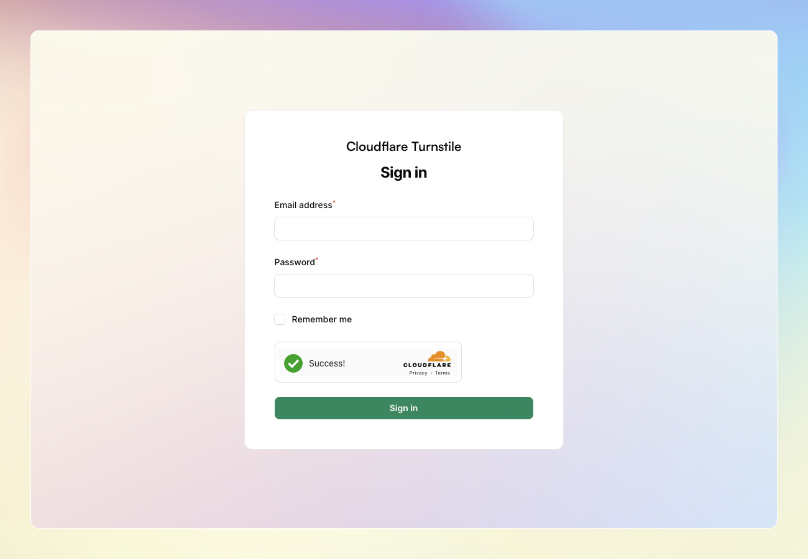

# Cloudflare Turnstile Integration for Filament V3
A plugin to help you implement the Cloudflare Turnstile into your Filament panels.

[](https://packagist.org/packages/afatmustafa/filamentv3-turnstile)
[](https://github.com/afatmustafa/filamentv3-turnstile/actions?query=workflow%3Arun-tests+branch%3Amain)
[](https://github.com/afatmustafa/filamentv3-turnstile/actions?query=workflow%3A"Fix+PHP+code+style+issues"+branch%3Amain)
[](https://packagist.org/packages/afatmustafa/filamentv3-turnstile)



This extension leverages [Laravel Turnstile](https://github.com/coderflexx/laravel-turnstile) under the hood. For more details, please refer to the __README__ on the project page.<br/>
Kudos to [coderflexx](https://github.com/coderflexx) for his remarkable work.

## Installation

You can install the package via composer:

```bash
composer require afatmustafa/filamentv3-turnstile
```
## Getting Started
To include __Cloudflare Turnstile__ in your app, you'll first need to obtain both the `SiteKey` and the `SecretKey` from your [Cloudflare dashboard](https://developers.cloudflare.com/turnstile/get-started/#get-a-sitekey-and-secret-key).

Once you have the __keys__, populate the `TURNSTILE_SITE_KEY` and `TURNSTILE_SECRET_KEY` fields in your `.env` configuration:

```env
TURNSTILE_SITE_KEY=2x00000000000000000000AB
TURNSTILE_SECRET_KEY=2x0000000000000000000000000000000AA
```
<br/>For testing purposes, Cloudflare offers Dummy site keys and secret keys. Consider using them if needed.
```env
TURNSTILE_SITE_KEY=1x00000000000000000000AA
TURNSTILE_SECRET_KEY=1x0000000000000000000000000000000AA
```
More dummy keys, please refer to the [Cloudflare documentation](https://developers.cloudflare.com/turnstile/reference/testing/).
## Form Component Usage

Now using Turnstile is quite simple, all you need to do is follow the code below:
```php
use Afatmustafa\FilamentTurnstile\Forms\Components\Turnstile;

    Turnstile::make('turnstile')
        ->theme('light') // Supported themes: light, dark
        ->size('normal') // Supported sizes: normal, compact
        ->language('en-US') // Supported languages: ar-eg,de,en,es,fa,fr,id,it,ja,ko,nl,pl,pt-br,ru,tr,uk,zh-cn and zh-tw
```

## Integrating Turnstile Captcha to Filament's Login Page
To seamlessly integrate the Turnstile captcha with the login page in Filament, follow these steps:

1. Create a new `Login` class under the `app/Filament\Pages\Auth` directory, and extend it from the `Filament\Pages\Auth\Login` class.</br>
Override the `form` method, and add the `Turnstile` component to the form schema.</br>
```php
namespace App\Filament\Pages\Auth;

use Filament\Forms\Form;
use Afatmustafa\FilamentTurnstile\Forms\Components\Turnstile;

class Login extends \Filament\Pages\Auth\Login
{
    public function form(Form $form): Form
    {
        return $form
            ->schema([
                $this->getEmailFormComponent(),
                $this->getPasswordFormComponent(),
                $this->getRememberFormComponent(),
                Turnstile::make('turnstile')
                    ->theme('light')
                    ->size('normal')
                    ->language('en-US'),
            ])
            ->statePath('data');
    }
}
```
</br>2. In your `PanelProvider` file, override the `login` method, and return the newly created `Login` class.
```php
namespace App\Providers\Filament;

...
use App\Filament\Pages\Auth\Login;
...

class AdminPanelProvider extends PanelProvider
{
    public function panel(Panel $panel): Panel
    {
        return $panel
            ->default()
            ->id('admin')
            ->path('app')
            ->login(Login::class)
            ...
    }
}
```
</br>3. That's it! You should now see the Turnstile captcha on the login page.

## Testing

```bash
composer test
```

## Changelog

Please see [CHANGELOG](CHANGELOG.md) for more information on what has changed recently.

## Contributing

Please see [CONTRIBUTING](.github/CONTRIBUTING.md) for details.

## Security Vulnerabilities

Please review [our security policy](../../security/policy) on how to report security vulnerabilities.

## Credits

- [Mustafa Afat](https://github.com/afatmustafa)
- [All Contributors](../../contributors)

## License

The MIT License (MIT). Please see [License File](LICENSE.md) for more information.
